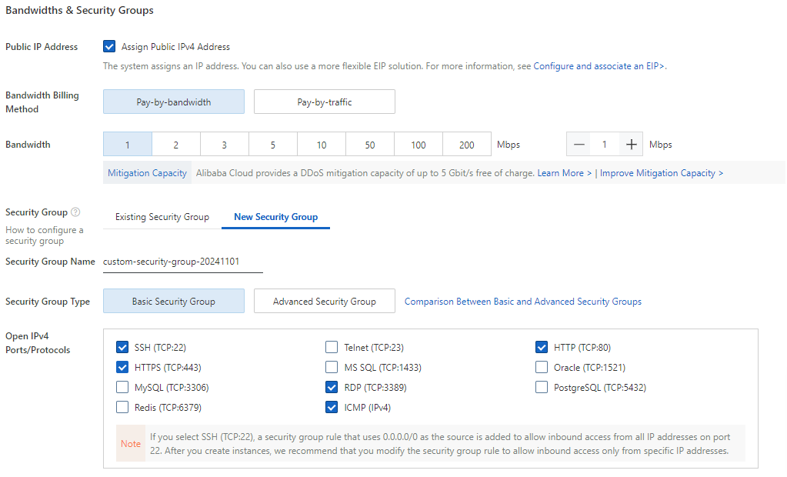

# What is Alibaba Cloud?
Alibaba Cloud is a cloud computing service provider from Alibaba Group, offering a wide range of cloud solutions, including data storage, databases, networking, artificial intelligence, and security. Known as one of the largest cloud providers in Asia, Alibaba Cloud provides infrastructure and digital tools for businesses to efficiently build and manage scalable applications.

## Create Instance
- Select Operating System.
- Choose Ubuntu.
:::note
I Use Ubuntu V.16.04 64bit.
:::

## Security Group
:::important
On security group try enable or check the HTTPS (TCP:443) and HTTP (TCP:80)
:::


## Management
- Logon Credential you can choose custom password 


- You can finish your order


# ECS

## Use ssh

:::tip
if you wanna use ssh instead of Remote connection from alibaba you can use ssh
:::

```bash
ssh root@your-public-ip
```
and then insert custom password you make on Logon Credential


## Use Terminal On alibaba cloud

- You can click Connect

- Click Sign in now

:::note
Connection use ip public
:::
- and then insert your password

# Terminal
first thing first you can update your ubuntu 
```bash
apt-update
```

## Install Nginx
installing nginx on your server
```bash
sudo apt install nginx -y
```

## Uploading file to server
Uploading file or folder,i choose github because is familiar for me.
- installing git into your server
```bash
apt install git
```
- make a repository on your github

### You can move into terminal and then copy this

```bash
cd /var/www/html
```
### Clone your repository

```bash
git clone https://github.com/your/repository
```

# Configure Nginx
- on your terminal type this

You can use Vim
```bash
vim /etc/nginx/sites-available/default
```
or Nano
```bash
nano /etc/nginx/sites-available/default
```

## Configure using nano

:::tip
Use your arrow key for move the cursor
:::

on the config you can see **root /var/www/html/yourprojectname;**

and then **Write Out** by type combination **CTRL + O**

if you see this file name to write you can hit **enter**

To EXIT nano type Combination key CTRL + X

## Restart Nginx
Restart Nginx by type this
```bash
sudo systemctl restart nginx
```

# Accses The Website

On instance you can copy the public ip into your search bar.
congratulations your website running on alibaba cloud using ECS


