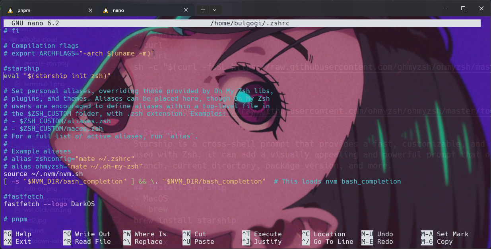
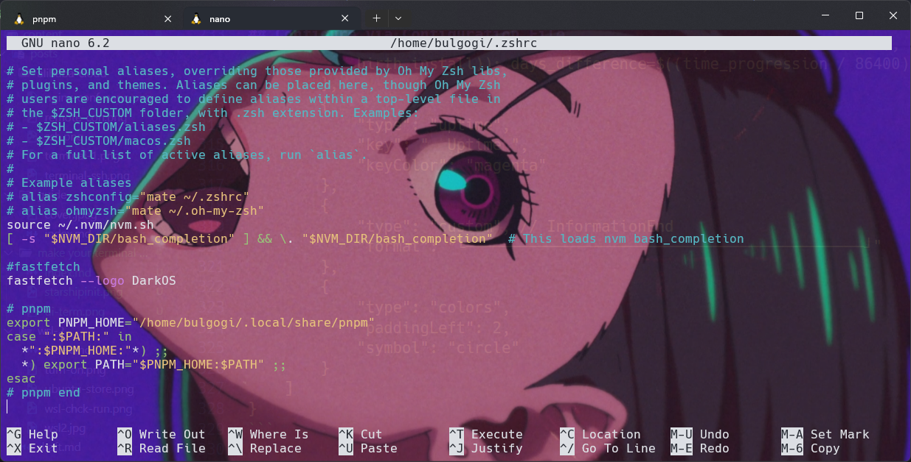

# ZSH
installing zsh on:

- **macOS**
```bash
brew install zsh
```
- **Ubuntu/Debian**
```bash
sudo apt update
sudo apt install zsh -y
```
- **Fedora**
```bash
sudo dnf install zsh -y
```
## Set Zsh as the Default Shell
Once Zsh is installed, make it your default shell by running
```bash
chsh -s $(which zsh)
```
After running this command, you may need to log out and log back in or restart your terminal to apply the change.

:::important
A Nerd Font installed and enabled in your terminal
:::

## Install Oh My Zsh
Oh My Zsh is a framework that manages Zsh configuration and makes it easy to add themes and plugins.

### Install 
- curl
```curl
sh -c "$(curl -fsSL https://raw.githubusercontent.com/ohmyzsh/ohmyzsh/master/tools/install.sh)"
```
- wget
```wget
sh -c "$(wget https://raw.githubusercontent.com/ohmyzsh/ohmyzsh/master/tools/install.sh -O -)"
```
# Starship
Starship is a cross-shell prompt that provides a fast, customizable, and informative prompt for your terminal. When used with Zsh, it can add a visually appealing and powerful prompt that displays useful information, such as the Git branch, current directory, package version, and more.

## Install Starship
- MacOS
```brew
brew install starship
```
- Linux
```bash
curl -sS https://starship.rs/install.sh | sh
```
## Add Starship to Zsh Configuration
- Open your Zsh configuration file (~/.zshrc) and add the following line at the end.

```bash
nano ~/.zshrc
```

if on your confg file have **ZSH_THEME=""**
,you can delete the zsh theme

- add this on ~/.zshrc
```bash
eval "$(starship init zsh)"
```


## Starship Configuration file
- create by typing
```bash
mkdir -p ~/.config && touch ~/.config/starship.toml
```
- copy my starship.toml.save
```bash
format = """
[ ](bold white)$hostname$kubernetes$directory$git_branch$git_commit$git_state$git_status$docker_context$package$golang$helm$java$cmake$julia$kotlin$lua$nim$nodejs$python$ruby$rust$swift$terraform$aws$gcloud$azure $battery               
[ ❯ ](bold green)"""

[aws]
symbol = "  "

[buf]
symbol = " "

[c]
symbol = " "

[conda]
symbol = " "

[dart]
symbol = " "

[directory]
read_only = " "
truncation_length = 7
truncation_symbol = "…/"

[hostname]
ssh_only = false
format = '[$hostname]($style) '
style = "blue bold"
trim_at = "."
disabled = false

[username]
style_user = "blue bold"
style_root = "red bold"
format = "[$user]($style) "
disabled = false
show_always = true

[docker_context]
symbol = " "

[elixir]
symbol = " "

[elm]
symbol = " "

[git_branch]
symbol = " "

[git_status]
ahead = "⇡🏎💨${count}"
diverged = "⇕⇡😵${ahead_count}⇣${behind_count}"
behind = "⇣😰${count}"
conflicted = "🏳 "
untracked = "🤷"
stashed = "📦"
modified = "📝"
staged = '[++\($count\)](green)'
renamed = "👅"
deleted ="🗑 "

[golang]
symbol = " "

[haskell]
symbol = " "

[hg_branch]
symbol = " "

[java]
symbol = " "

[julia]
symbol = " "

[lua]
symbol = " "

[memory_usage]
symbol = " "

[meson]
symbol = "喝 "

[nim]
symbol = " "

[nix_shell]
symbol = " "

[nodejs]
symbol = " "

[package]
symbol = " "

[python]
symbol = " "

[rlang]
symbol = "ﳒ "

[ruby]
symbol = " "

[rust]
symbol = " "

[scala]
symbol = " "

[spack]
symbol = "🅢 "

[battery]
full_symbol = "🔋"
charging_symbol = "🔌 "
discharging_symbol = "⚡️"

[[battery.display]]  # "bold red" style when capacity is between 0% and 10%
threshold = 10
style = "bold red"

[[battery.display]]  # "bold yellow" style when capacity is between 10% and 30%
threshold = 30
style = "bold yellow"

[[battery.display]]
threshold = 100
style = "bold g
```

# Fastfetch
Fastfetch is a command-line tool for displaying system information in a visually appealing way, similar to tools like Neofetch. It’s highly customizable, allowing you to configure the colors, layout, and displayed information to suit your preferences. Here’s how to set up and configure Fastfetch.

## Install Fastfetch
- MacOS
```bash
brew install fastfetch
```
- Ubuntu/Debian
```bash
sudo apt update
sudo apt install fastfetch -y
```
- Archlinux
```bash
sudo pacman -S fastfetch
```

## Configure via Configuration File
For persistent configuration, create a configuration file. On Linux and macOS, this file should be placed in ~/.config/fastfetch/config.jsonc 
- To create the config file
```bash
mkdir -p ~/.config/fastfetch
touch ~/.config/fastfetch/config.jsonc
```

- and then copy my config.jsonc
```bash
{
    "$schema": "https://github.com/fastfetch-cli/fastfetch/raw/dev/doc/json_schema.json",
    "logo": {
        "type": "builtin",
        "color": {
            "1": "white",
            "2": "cyan"
        }
    },
    "display": {
        "separator": " → ",
        "color": "cyan"
    },
    "modules": [
        {
            "type": "custom", // HardwareStart
            "format": "┌─────────── \u001b[1mHardware Information\u001b[0m ───────────┐" // \u001b is \033, or \e
        },
        {
            "type": "host",
            "key": "  󰌢"
        },
        {
            "type": "cpu",
            "key": "  "
        },
        {
            "type": "gpu",
            "detectionMethod": "pci",
            "key": "  "
        },
        {
            "type": "display",
            "key": "  󱄄"
        },
        {
            "type": "memory",
            "key": "  "
        },
        {
            "type": "custom", // SoftwareStart
            "format": "├─────────── \u001b[1mSoftware Information\u001b[0m ───────────┤"
        },
        {
            "type": "os",
            "key": "  " // Just get your distro's logo off nerdfonts.com,
        },
        {
            "type": "kernel",
            "key": "  ",
            "format": "{1} {2}"
        },
        {
            "type": "wm",
            "key": "  "
        },
        {
            "type": "shell",
            "key": "  "
        },
        {
            "type": "custom",
            "format": "|──────────────\u001b[1mUptime / Age\u001b[0m──────────────────|"
        },
        {
            "type": "command",
            "key": "  OS Age ",
            "keyColor": "magenta",
            "text": "birth_install=$(stat -c %W /); current=$(date +%s); time_progression=$((current - birth_install)); days_difference=$((time_progression / 86400)); echo $days_difference days"
        },
        {
            "type": "uptime",
            "key": "  Uptime ",
            "keyColor": "magenta"
        },
        {
            "type": "custom", // InformationEnd
            "format": "└────────────────────────────────────────────┘"
        },
        {
            "type": "colors",
            "paddingLeft": 2,
            "symbol": "circle"
        }
    ]
}
```

## Fastfetch Startup 

- open your **~/.zshrc** add this:
```bash
fastfetch
```

# Done