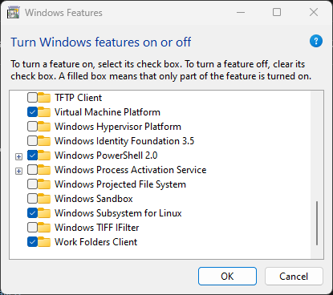
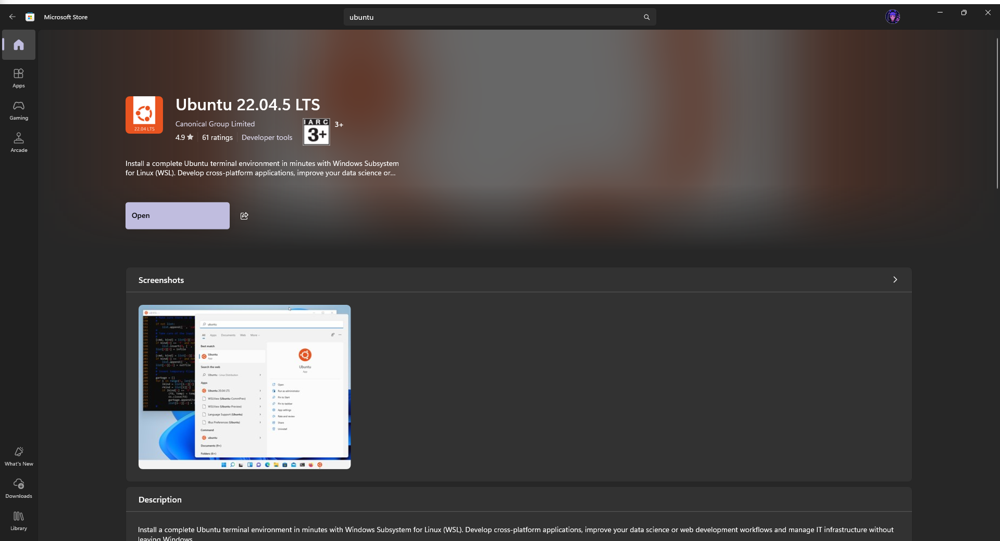
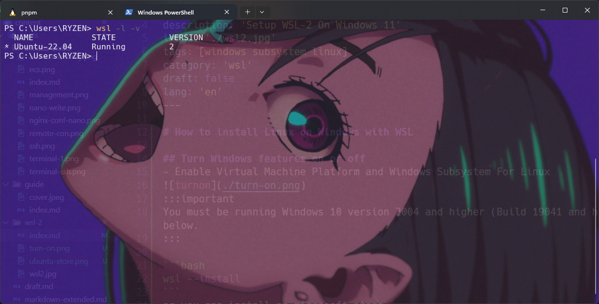

# How to install Linux on Windows with WSL

## Turn Windows features on or off
- Enable Virtual Machine Platform and Windows Subsystem For Linux

:::important
You must be running Windows 10 version 2004 and higher (Build 19041 and higher) or Windows 11 to use the commands below.
:::

```bash
wsl --install
```
or you can install on microsoft store


## Check Your WSL Running Or Not
```bash
wsl -l -v
```


## Upgrade version from WSL 1 to WSL 2

:::important
To set the default version to WSL 1 or WSL 2 when a new Linux distribution is installed
:::
```bash
wsl --set-version Ubuntu-20.04 2
```

# Done Your WSL now is version 2